# Assignment 3

**Name:** Aruzhan Abdrakhmanova  
**Group:** IT-2501  
**Site** https://arabdrakh.github.io/front3/

## Tasks

**Task 0. Responsive Typography:**  
Created a webpage with headings and paragraphs. Media queries change the font sizes for mobile, tablet, and desktop screens
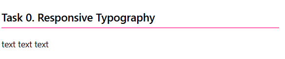

**Task 1. Responsive Layout with Media Queries:**  

Mobile: boxes are stacked vertically.
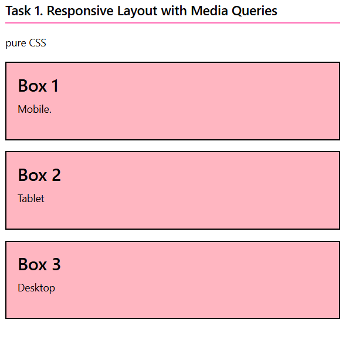

Tablet: two boxes are displayed in a row.
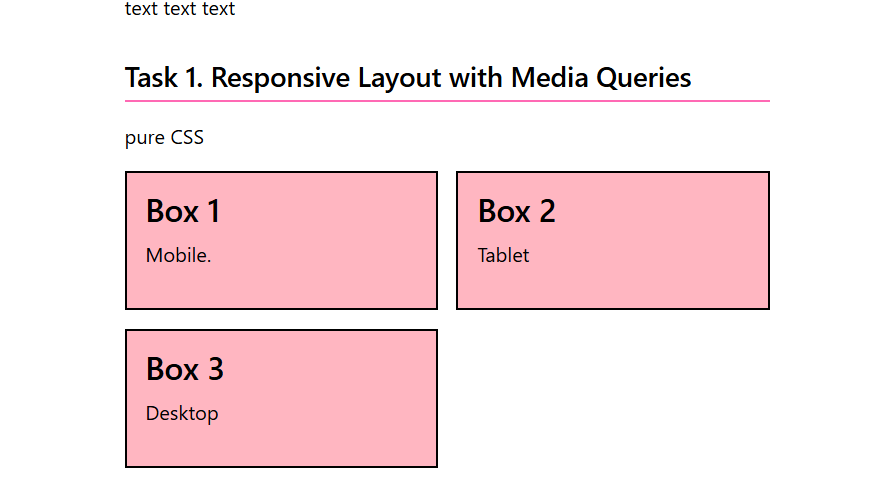

Desktop: three boxes are displayed in a row.
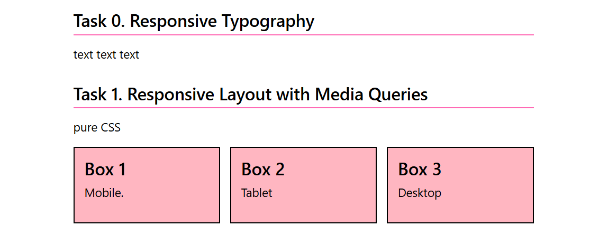

**Task 2. Bootstrap Responsive Columns:**  
   Bootstrap's 12-column grid:
Mobile: each column takes 12 columns.
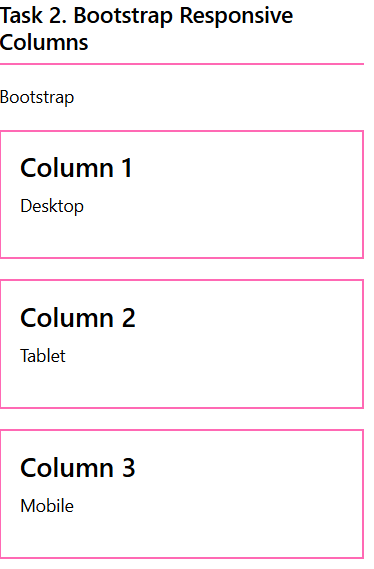

Tablet: each column takes 6 columns.
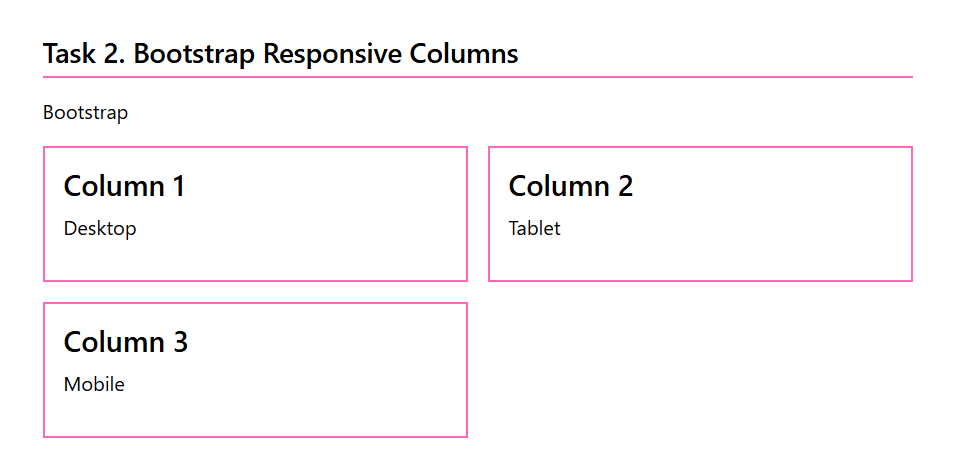

Desktop: each column takes 4 columns.
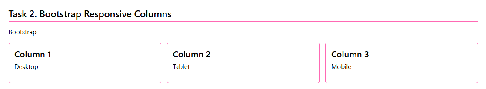

 **Task 3. Bootstrap Navigation Bar:**  
  Desktop
  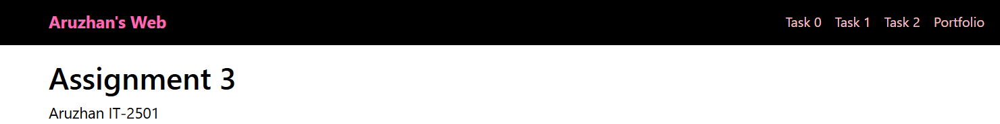

  Tablet
  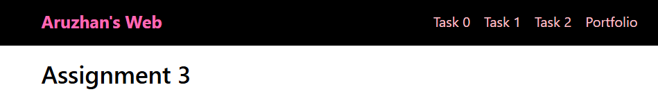

  Mobile
  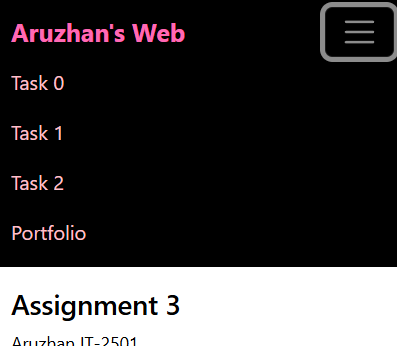

 **Task 4. Responsive Portfolio Page:**  
  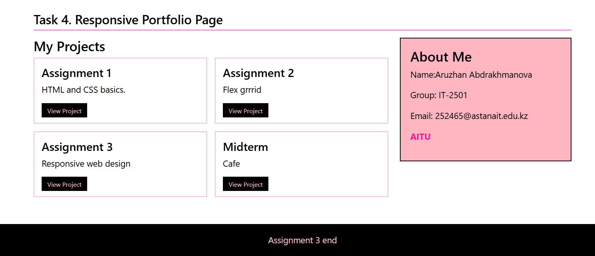

## Work Process

All five tasks are organized on a single index.html page, with custom styles in an internal CSS block. Bootstrap 5.3.3 is loaded from a CDN and provides the grid utilities and interactive navigation behavior. 

CSS media queries adjust the heading and paragraph sizes at the 600px and 900px breakpoints. The CSS Grid layout changes from one column on small screens to two columns at 600px and three columns at 900px. Bootstrap’s 12-column grid displays one column on small screens, two columns from the md breakpoint, and three columns from the lg breakpoint. The responsive navbar collapses on smaller screens and expands from the md breakpoint. On the portfolio page, Bootstrap’s grid places the project cards beside an About Me sidebar on wider screens, while the .extra-info` element appears from 600px.

