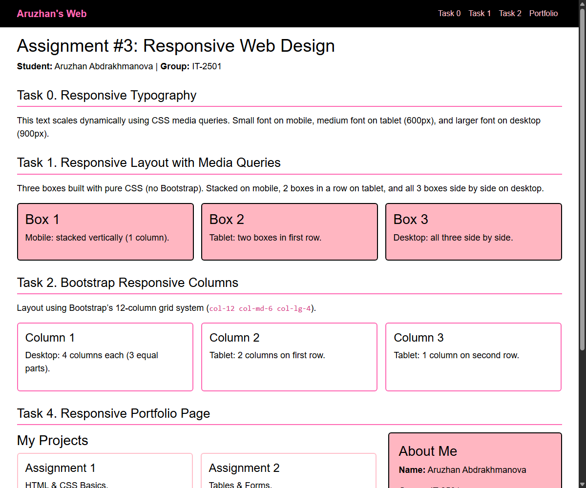
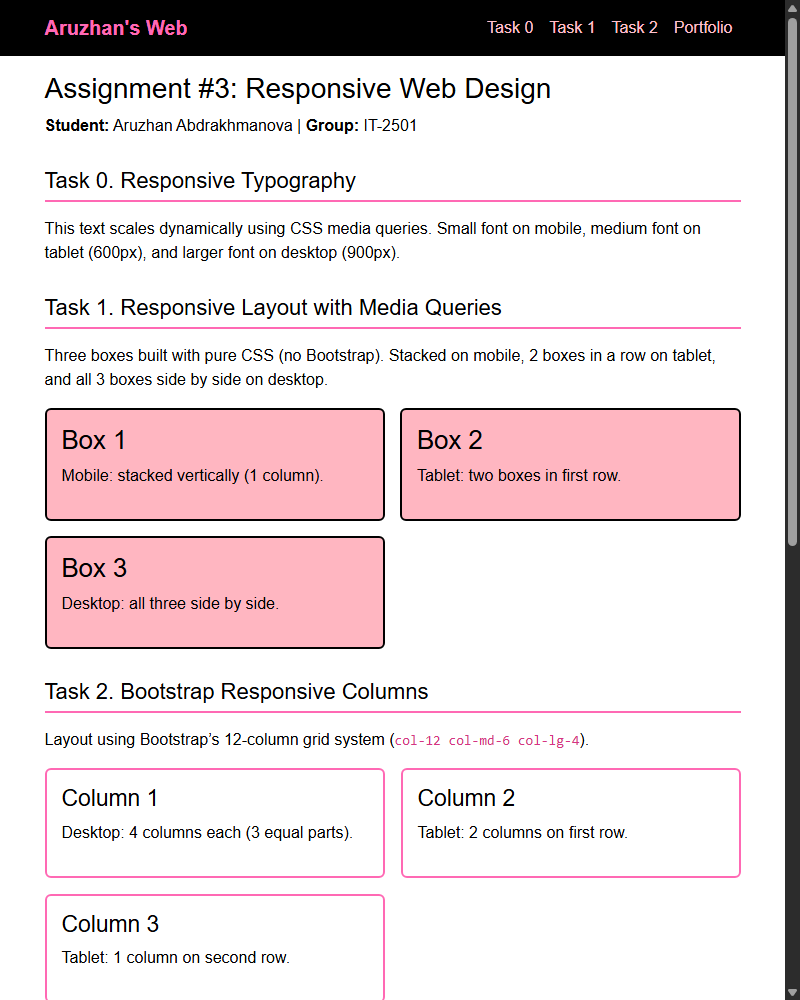
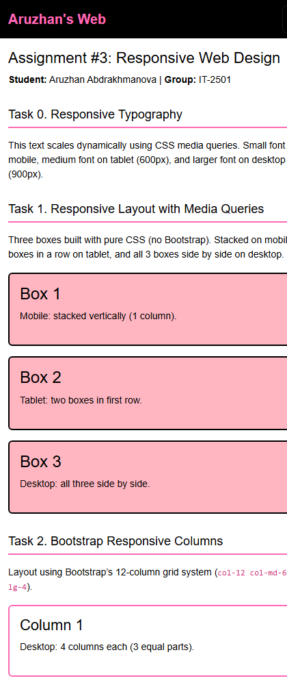

# Assignment #3: Responsive Web Design (Media Queries + Bootstrap Grid)

**Course:** Web Technologies Front-End Development  
**Student Name:** Aruzhan Abdrakhmanova  
**Group:** IT-2501  
**University:** Astana IT University  

---

## 📌 Project Overview

All assignment tasks are implemented in a single unified file `index.html` with an embedded `<style>` stylesheet. The project follows a **pink and black** color palette, using only named CSS color keywords (`pink`, `black`, `white`, `lightpink`, `hotpink`, `deeppink`).

### 📁 File Structure

```text
front3/
├── index.html          # All tasks in one unified responsive file
├── screenshots/        # Screenshots for desktop, tablet, and mobile
│   ├── desktop.png
│   ├── tablet.png
│   └── mobile.png
└── README.md           # Assignment Report
```

---

## 📋 Assignment Tasks

### Part 1. Media Queries

- **Task 0. Responsive Typography:**  
  Headings (`h1`, `h2`) and paragraphs (`p`) scale dynamically via CSS media queries:
  - Mobile (< 600px): small font
  - Tablet (≥ 600px): medium font
  - Desktop (≥ 900px): larger font

- **Task 1. Responsive Layout with Media Queries:**  
  Three boxes built strictly using pure CSS Media Queries and CSS Grid (no Bootstrap):
  - Desktop (≥ 900px): all 3 boxes side by side (`1fr 1fr 1fr`)
  - Tablet (600px – 899px): 2 boxes on the first row, 1 on the second row (`1fr 1fr`)
  - Mobile (< 600px): stacked vertically (`1fr`)

### Part 2. Bootstrap Grid System

- **Task 2. Bootstrap Responsive Columns:**  
  Built using Bootstrap’s 12-column grid (`col-12 col-md-6 col-lg-4`):
  - Desktop: 4 columns each (3 equal parts in one row)
  - Tablet: 2 columns on first row, 1 on second row
  - Mobile: stacked vertically (12 columns each)

- **Task 3. Bootstrap Navigation Bar:**  
  Responsive navbar at the top of the page:
  - Logo on the left (`Aruzhan's Web`)
  - Navigation links on the right (`ms-auto`)
  - Collapses into a hamburger menu button on smaller screens (< 768px)

### Part 3. Combined Project

- **Task 4. Responsive Portfolio Page:**  
  - Header with Bootstrap navbar
  - Left side (`col-lg-8`): Portfolio projects arranged in Bootstrap grid (`col-md-6`)
  - Right side (`col-lg-4`): Sidebar with student info and `.extra-info` element
  - Element visibility via Media Queries: `.extra-info` is hidden on mobile (`display: none;`) and shown on tablet/desktop via `display: block;`
  - Footer across the bottom

---

## 📸 Screenshots

### 1. Desktop View (≥ 900px)


### 2. Tablet View (600px – 899px)


### 3. Mobile View (< 600px)


---

## 📝 Brief Summary of Work Process

1. **Architecture Consolidation:**  
   Unified all tasks into a single clean `index.html` file, removing redundant external stylesheets and separate pages.
2. **Color Palette & Styling:**  
   Applied a pink-and-black color scheme using only CSS named color keywords (`pink`, `black`, `white`, `lightpink`, `hotpink`, `deeppink`).
3. **Responsive Implementation:**  
   - Implemented pure CSS media queries for font scaling (Task 0) and 3-box grid layout (Task 1).
   - Applied Bootstrap’s 12-column grid system for columns (Task 2) and collapsible navbar (Task 3).
   - Integrated both techniques in Task 4, using `display: none` / `display: block` for the `.extra-info` element visibility.
4. **Testing & Verification:**  
   Verified responsiveness across desktop (1200px), tablet (800px), and mobile (420px) viewports and captured screenshots for documentation.

---

## 📚 References & Resources

1. Abitova G.A., *Web technologies Front-End Development. Part 1*, 2022.
2. [Bootstrap 5.3 Documentation](https://getbootstrap.com/docs/5.3/getting-started/introduction/)
3. [MDN Web Docs - Responsive Design](https://developer.mozilla.org/en-US/docs/Learn_web_development/Core/CSS_layout/Responsive_Design)
4. [W3Schools - CSS Media Queries](https://www.w3schools.com/css/css_rwd_mediaqueries.asp)
