# Assignment #3: Responsive Web Design (Media Queries + Bootstrap Grid)

**Course:** Web Technologies Front-End Development  
**Student Name:** Aruzhan Abdrakhmanova  
**Group:** IT-2501  
**University:** Astana IT University  

---

## 📌 Project Overview

The objective of this assignment is to master responsive web design principles using both **pure CSS Media Queries** and the **Bootstrap 5 12-Column Grid System**. The project demonstrates how layouts and typography dynamically adapt to mobile, tablet, and desktop viewport sizes.

### 📁 File Structure

```text
front3/
├── index.html          # Task 4: Main Responsive Portfolio Page
├── style.css           # Task 4: Custom CSS with custom media queries
├── task0.html          # Task 0: Responsive Typography (Pure CSS)
├── task1.html          # Task 1: Responsive 3-Box Layout (Pure CSS Media Queries)
├── task2.html          # Task 2: Bootstrap 12-Column Responsive Grid
├── task3.html          # Task 3: Bootstrap Responsive Navigation Bar
├── screenshots/        # Captured screenshots for all tasks across viewports
└── README.md           # Assignment Report
```

---

## Part 1. Media Queries

### Task 0. Responsive Typography

- **Description:**  
  A webpage created with semantic headings (`h1`, `h2`) and paragraphs (`p`). Pure CSS media queries adapt the font sizes across mobile, tablet, and desktop viewports without any external CSS framework.
  - **Mobile (`< 768px`):** `h1`: 22px, `h2`: 18px, `p`: 14px
  - **Tablet (`768px` – `1023px`):** `h1`: 30px, `h2`: 24px, `p`: 16px
  - **Desktop (`≥ 1024px`):** `h1`: 38px, `h2`: 28px, `p`: 18px

#### Task 0 Screenshots

**Desktop View (≥ 1024px):**
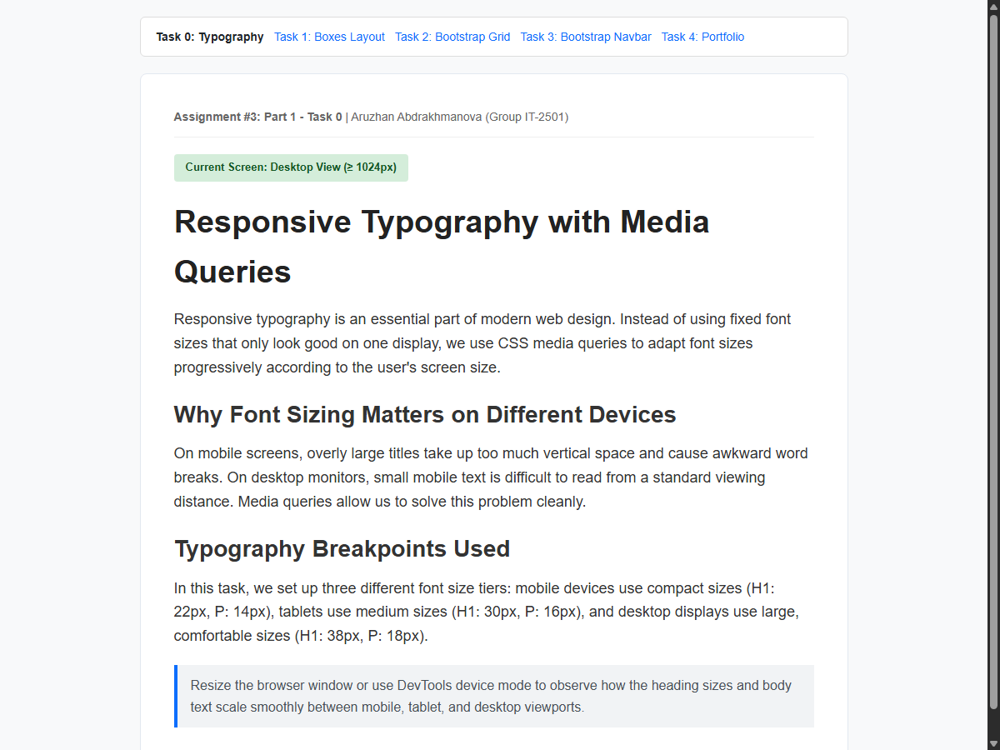

**Tablet View (768px - 1023px):**
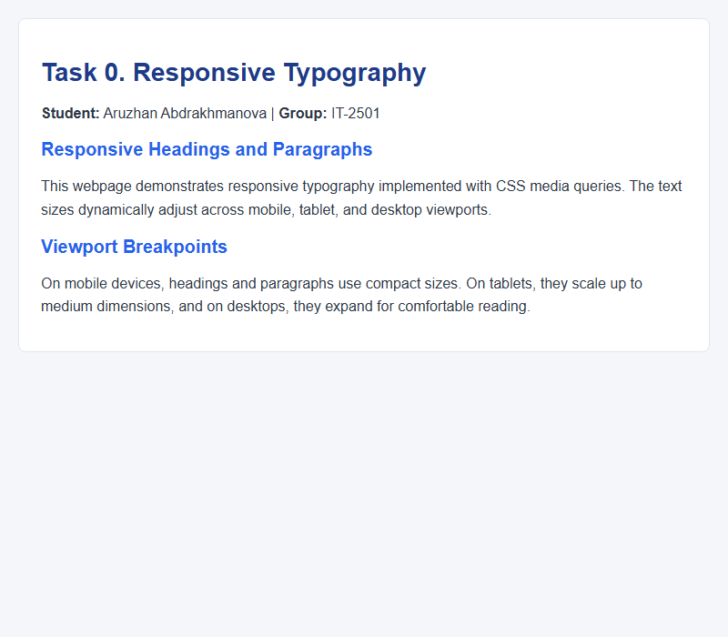

**Mobile View (< 768px):**
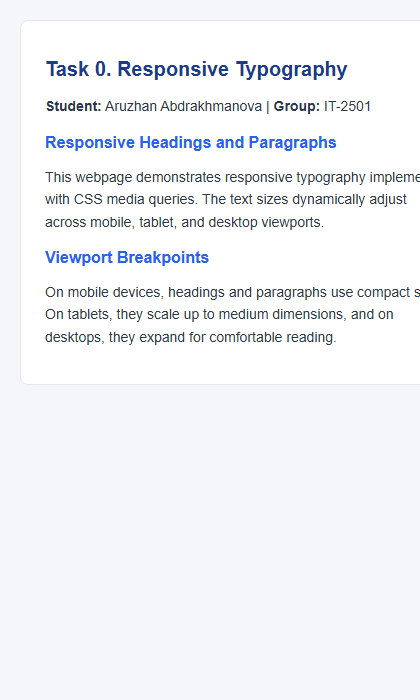

---

### Task 1. Responsive Layout with Media Queries

- **Description:**  
  A responsive layout with three content boxes built strictly using pure CSS Media Queries and Flexbox (no Bootstrap).
  - **Desktop (`≥ 1024px`):** All 3 boxes are displayed side by side (`width: calc((100% - 40px) / 3)`).
  - **Tablet (`768px` – `1023px`):** 2 boxes on the first row, and the third box wraps to the second row (`width: calc(50% - 10px)`).
  - **Mobile (`< 768px`):** All boxes are stacked vertically at full width (`width: 100%`).

#### Task 1 Screenshots

**Desktop View (≥ 1024px) — 3 side by side:**
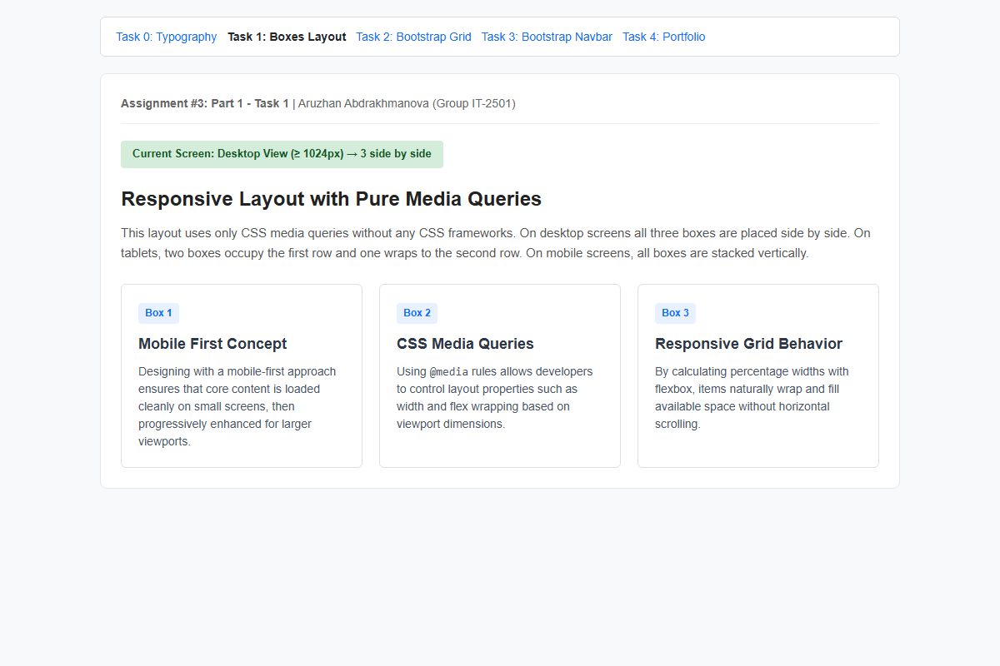

**Tablet View (768px - 1023px) — 2 in first row, 1 in second row:**
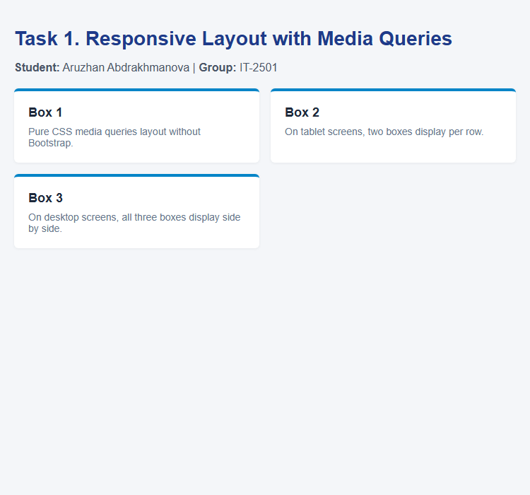

**Mobile View (< 768px) — Stacked vertically:**
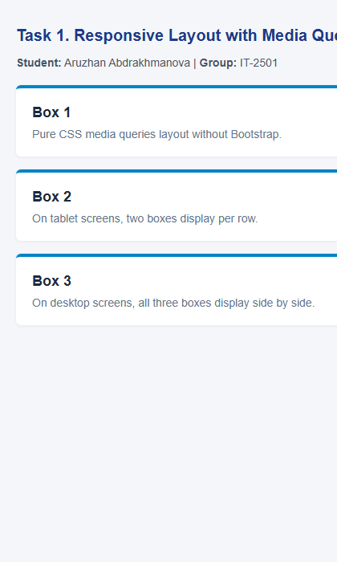

---

## Part 2. Bootstrap Grid System

### Task 2. Bootstrap Responsive Columns

- **Description:**  
  A responsive layout utilizing Bootstrap’s 12-column grid system (`row` and `col-*` classes).
  - Each column uses the class `col-12 col-md-6 col-lg-4`.
  - **Desktop (`lg` ≥ 992px):** Each card occupies 4 columns (4 + 4 + 4 = 12 columns, 3 equal parts side by side).
  - **Tablet (`md` 768px – 991px):** Each card occupies 6 columns, resulting in 2 columns on the first row (6 + 6 = 12) and the third column wrapping to the second row.
  - **Mobile (`< 768px`):** Each card takes 12 columns (`col-12`), stacking all cards vertically.

#### Task 2 Screenshots

**Desktop View (3 equal columns):**
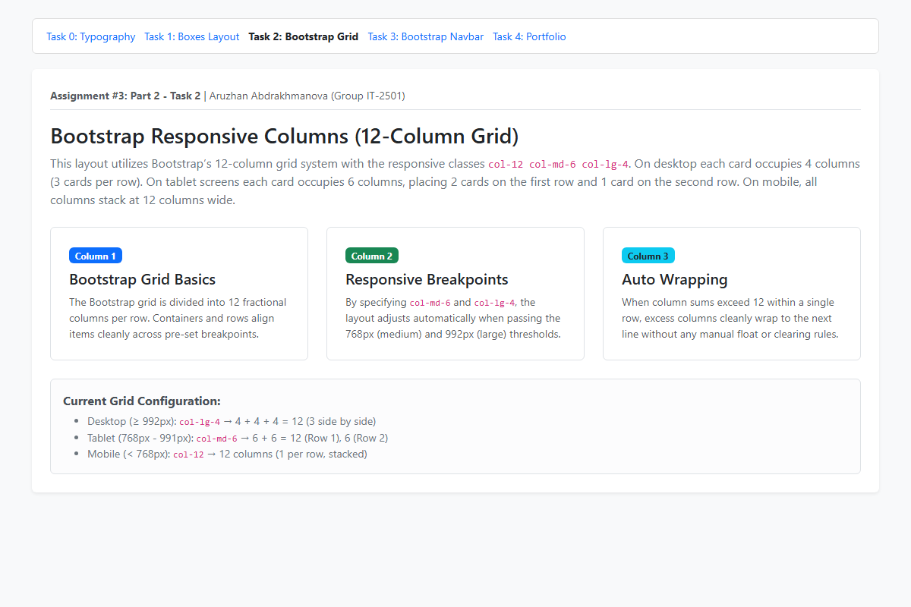

**Tablet View (2 on row 1, 1 on row 2):**
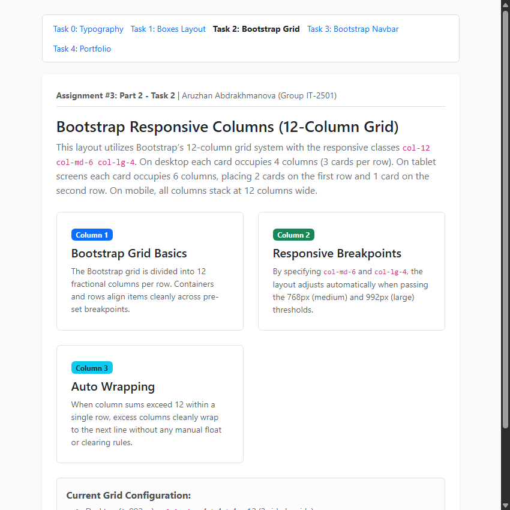

**Mobile View (Stacked columns):**
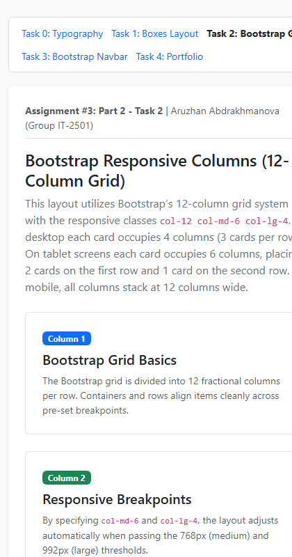

---

### Task 3. Bootstrap Navigation Bar

- **Description:**  
  A responsive navbar built using Bootstrap 5 components:
  - **Logo on the left:** Brand name (`<Aruzhan/> WebDev`) aligned using `.navbar-brand`.
  - **Links on the right:** Navigation links right-aligned using Bootstrap's `ms-auto` class.
  - **Collapsible menu:** When the viewport width is below the `lg` breakpoint (`< 992px`), navigation links collapse into an accessible hamburger menu (`navbar-toggler`) that opens and closes smoothly via Bootstrap JS.

#### Task 3 Screenshots

**Desktop View (Logo left, links right):**
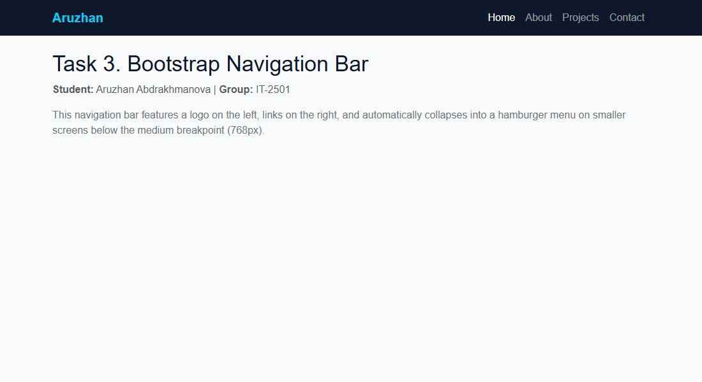

**Mobile View (Collapsed into hamburger menu button):**
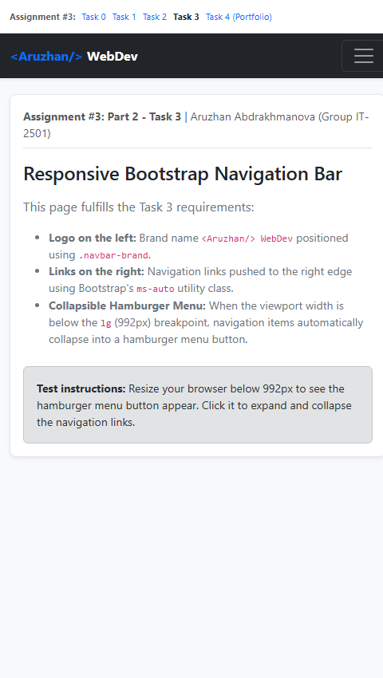

---

## Part 3. Combined Project

### Task 4. Responsive Portfolio Page (`index.html` & `style.css`)

- **Description:**  
  A complete personal portfolio page combining both Bootstrap 5 Grid and custom CSS Media Queries in `style.css`:
  1. **Header:** Responsive Bootstrap navbar with logo on the left, collapsible hamburger toggler, and navigation links.
  2. **Main Section:**
     - **Left Side (`col-12 col-lg-8`):** Portfolio project cards arranged using Bootstrap grid (`col-12 col-md-6`).
     - **Right Side (`col-12 col-lg-4`):** Sidebar containing personal information, student bio, technical skills, and contact details.
  3. **Footer:** Bottom footer with copyright and university affiliation.
  4. **Custom Media Queries (`style.css`):**
     - Adjusts typography scale across mobile, tablet, and desktop.
     - Controls spacing (card padding, section margins).
     - Manages element visibility (hiding non-essential notes on mobile, enabling sticky sidebar on desktop).

#### Task 4 Screenshots

**Desktop View:**
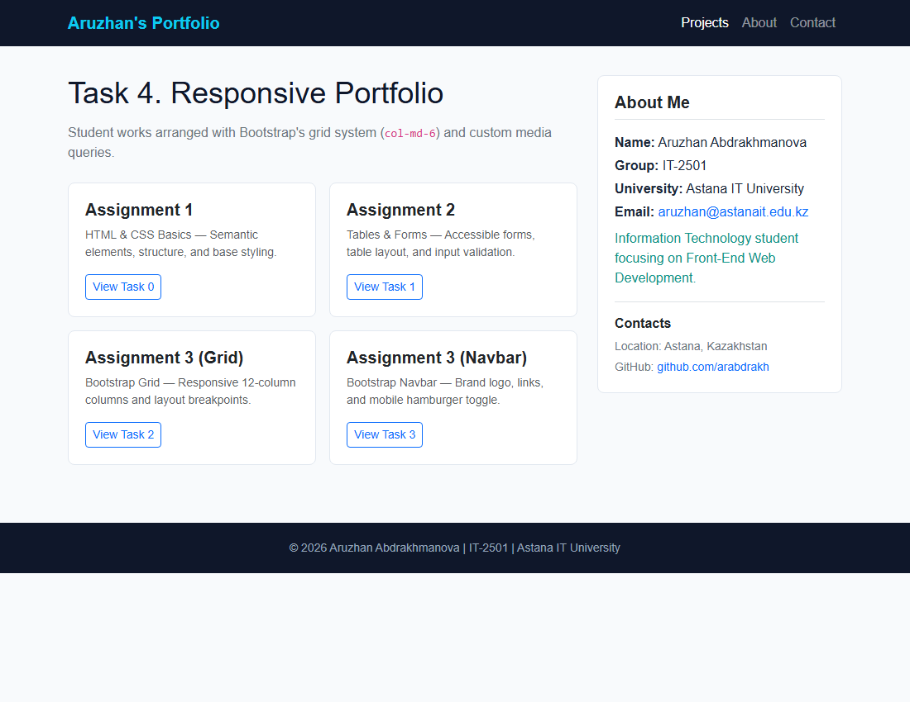

**Tablet View:**
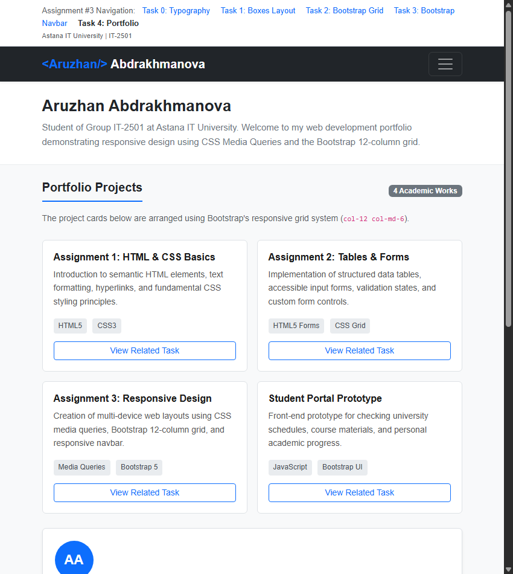

**Mobile View:**
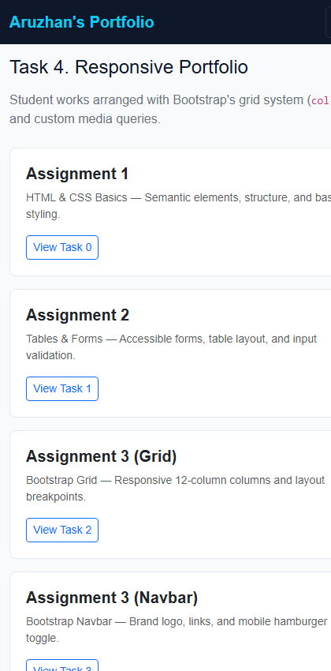

---

## 📝 Brief Summary of Work Process

1. **Studying Fundamentals & Breakpoints:**  
   Reviewed standard CSS media query syntax and Bootstrap's breakpoint system (`sm: 576px`, `md: 768px`, `lg: 992px`, `xl: 1200px`).

2. **Part 1 — Pure Media Queries:**  
   - Implemented `task0.html` to demonstrate responsive typography, scaling headings and body text progressively without any framework.
   - Built `task1.html` using CSS Flexbox with calculated widths (`calc()`) to achieve 3 boxes side by side on desktop, 2 on tablet, and 1 on mobile.

3. **Part 2 — Bootstrap 5 Grid & Navbar:**  
   - Created `task2.html` using the 12-column grid (`col-12 col-md-6 col-lg-4`) to satisfy exact column wrapping requirements.
   - Built `task3.html` using the Bootstrap `navbar` component with brand logo on the left, `ms-auto` for right alignment, and `navbar-toggler` for mobile collapsing.

4. **Part 3 — Combined Portfolio Page:**  
   - Developed `index.html` and `style.css` combining Bootstrap's grid structure for the layout with custom media queries for font scaling, padding, and element visibility.
   - Kept the code and visual design clean, structured, and realistic according to practical academic standards.

5. **Testing & Verification:**  
   - Tested each page across multiple screen dimensions (Mobile: 480px, Tablet: 850px, Desktop: 1200px).
   - Captured real screenshots of all tasks across breakpoints for the report.
   - Committed each task incrementally with clear Git commit messages.

---

## 📚 References & Resources

1. Abitova G.A., *Web technologies Front-End Development. Part 1*, 2022.
2. [Bootstrap 5.3 Documentation](https://getbootstrap.com/docs/5.3/getting-started/introduction/)
3. [MDN Web Docs - Responsive Design](https://developer.mozilla.org/en-US/docs/Learn_web_development/Core/CSS_layout/Responsive_Design)
4. [W3Schools - CSS Media Queries](https://www.w3schools.com/css/css_rwd_mediaqueries.asp)
